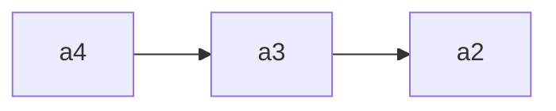

## 什么是线性反馈移位寄存器

我先递归学习了几个数学概念

### 母函数（生成函数）

#### 普通型母函数

**定义**：

对于任意一个数列$a_0,a_1,a_2\cdots a_n$，用它的每一项可以定义一个函数：
$$
G(x)=a_0+a_1x+a_2x^2+\cdots +a_nx^n 
$$
则G(x)是数列的生成函数，或者更准确地说，是一个**无穷级数**

> 虽然说是一个无穷级数，但我们可以设置$j>n$时，$a_j=0$之类的，使得G(x)成为一个n次多项式，但又是一个无穷序列（doge

更数学一点的表示形式如下：
$$
G(a_n;x)=\Sigma_{n=0}^\infty a_nx^n
$$

#### 指数型母函数

一般形式为：
$$
EG(a_n;x)=\Sigma_{n=0}^\infty a_n\frac{x^n}{n!}
$$

### 有限数域上的LFSR

> 有限数域一般是gf(2)，即只含有0, 1两个数

#### 说明与定义

- 移位寄存器主要功能是产生密钥流
- gf(2)表示存储器为二元存储器，只能取0或1
- n级表示n个存储器
- 线性表示反馈函数$f(a1,a2,…,an)$为线性函数,运算有与或非，与反馈移位寄存器的状态有关，状态有$2^n$种
- 初始状态由用户决定


<div align="center">图1</div>


<div align="center">图2</div>

可作递推模拟如下：
$$
a_{n+t}=c_1a_{n+t-1}\bigoplus c_2a_{n+t-2}\bigoplus\cdots \bigoplus c_na_{t}, t=1,2,\cdots 
$$
**让我们看一个3级的例子**


定义初始状态为

| $a_1$ | $a_2$ | $a_3$ |
| :---: | :---: | :---: |
|   1   |   0   |   1   |

则$a_4=a_1\bigoplus a_3=0$，然后流出一个$a_1$，3个寄存器变为



反馈函数变为$f(a_2,a_3,a_4)=a_2\bigoplus a_4$

反复进行几轮上述操作，就可以得到输出序列，以及周期

#### LFSR输出序列的性质

线性反馈移位寄存器实现起来简单，速度快，而且有较为成功的理论，成为构造密钥流生成器的最重要的部件之一。
我们总是假定$c_1,c_2,…,c_n$中至少有一个不为0，否则$f(a1,a2,…,an)=0$，总是假定$c_n=1$。

- $n级LFSR状态数：最多有2^n个$
- $n级LFSR的状态周期：\leq2^n-1$
- $输出序列的周期=状态周期\leq2^n-1$
- $选择合适的反馈函数可使序列的周期达到最大值2^n-1，周期达到最大值的序列称为m序列。$

#### 数学推导与算法

> 摘自[CTFwiki](https://ctf-wiki.org)

线性反馈移位寄存器的反馈函数一般如下
$$
a_{i+n} = \Sigma_{j=1}^n c_ja_{i+n-j} \tag{1}
$$


其中，$c_j$均在某个有限域 $F_q$ 中。

进而，可以求得其**特征多项式**为
$$
f(x)=x^n-\Sigma_{i=1}^n c_ix^{n-i} \tag{2}
$$

> 通过线性变换得到，由于还没学，就先随便写写啦hhh
> $$
> \left[
> \begin{matrix}
> a_{i+1},a_{i+2},a_{i+3},\cdots,a_{i+n}
> \end{matrix}
> \right] \\
> =
> \left[
> \begin{matrix}
> a_{i+1},a_{i+2},a_{i+3},\cdots,a_{i+n}
> \end{matrix}
> \right]
> \left[
> \begin{matrix}
> 0 & 0 & \cdots & 0 & c_n\\
> 1 & 0 & \cdots & 0 & c_{n-1}\\
> 0 & 1 & \cdots & 0 & c_{n-2}\\
> \vdots& \vdots &\ddots&\vdots\\
> 0 & 0 & \cdots & 1 & c_1
> \end{matrix}
> \right]\\
> =
> \left[
> \begin{matrix}
> a_{0},a_{1},a_{2},\cdots,a_{n-1}
> \end{matrix}
> \right]
> \left[
> \begin{matrix}
> 0 & 0 & \cdots & 0 & c_n\\
> 1 & 0 & \cdots & 0 & c_{n-1}\\
> 0 & 1 & \cdots & 0 & c_{n-2}\\
> \vdots& \vdots &\ddots&\vdots\\
> 0 & 0 & \cdots & 1 & c_1
> \end{matrix}
> \right]
> ^{i+1}
> $$
>
> 

同时，定义其**互反多项式**为
$$
\bar f(x) = x^nf(\frac 1 x) = 1 - \Sigma_{i=1}^n c_ix^i
$$


也称互反多项式为线性反馈移位寄存器的联结多项式。


#### 特征多项式与生成函数

已知某个 n 级线性反馈移位寄存器的特征多项式，那么该序列对应的生成函数为
$$
A(x) = \frac {p(x)} {\bar f(x)}
$$


其中$p(x) = \Sigma_{i=1}^n(c_{n-i}x^{n-i}\Sigma_{j=1}^ia_jx^{j-1})$。可以看出 $p(x) $完全由初始状态和反馈函数的系数决定。

#### 序列周期与生成函数

序列的的周期为其生成函数的既约真分式的分母的周期。

对于 n 级线性反馈移位寄存器，最长周期为 $2^n−1$（排除全零）。达到最长周期的序列一般称为 m 序列。

#### 特殊性质

- 将两个序列累加得到新的序列的周期为这两个序列的周期的和。
- 序列是 n 级 m 序列，当且仅当序列的极小多项式是 n 次本原多项式。

#### B-M 算法

一般来说，我们可以从两种角度来考虑 LFSR

- 密钥生成角度，一般我们希望使用**级数尽可能低**的 LFSR 来生成周期大，随机性好的序列。
- 密码分析角度，给定一个长度为 n 的序列 a，如何**构造一个级数尽可能小**的 LFSR 来生成它。其实这就是 B-M 算法的来源。

一般来说，我们定义一个序列的线性复杂度如下

- 若 s 为一个全零序列，则线性复杂度为 0。
- 若没有 LFSR 能生成 s，则线性复杂度为无穷。
- 否则，s 的线性复杂度为生成 L(s) 的最小级的 LFSR。

BM 算法的要求我们需要知道长度为 2n 的序列。其复杂度

- 时间复杂度：$O(n^2)$ 次比特操作
- 空间复杂度：$O(n) $比特。

关于 BM 算法的细节，后续添加，目前处于学习过程中。

但是其实如果我们知道了长度为 2n 的序列，我们也可以一种比较笨的方法来获取原先的序列。不妨假设已知的序列为$a_1,...,a_{2n}$，我们可以令
$$
S_1=(a_1,...,a_n)\\

S_2=(a_2,...,a_{n+1})\\

....\\

S_{n+1}=(a_{n+1},...,a_{2n})
$$
那么我们可以构造矩阵$ X=(S_1,...,S_n)$，那么

$S_{n+1}=(c_n,...,c_1)X$

所以$(c_n,...,c_1)=S_{n+1}X^{−1}$

进而我们也就知道了 LFSR 的反馈表达式，进而我们就可以推出初始化种子。

### 例子

#### 2018 CISCN 初赛 oldstreamgame

```python
flag = "flag{xxxxxxxxxxxxxxxx}"
assert flag.startswith("flag{")
assert flag.endswith("}")
assert len(flag)==14

def lfsr(R,mask):
    output = (R << 1) & 0xffffffff # R<<1，取低32位，最后一位是0
    i=(R&mask)&0xffffffff # R和mask与一下
    lastbit=0
    while i!=0:
        lastbit^=(i&1) # i由最后一位逐位向最高位异或，存在lastbit中，lastbit只有1个bit
        i=i>>1
    output^=lastbit # out的最后一位变成lastbit，其它不变
    return (output,lastbit)

R=int(flag[5:-1],16) # 长度为8*4=32bits，内容为16进制
mask = 0b10100100000010000000100010010100 # 32bits

f=open("key","w")
for i in range(100):
    tmp=0
    for j in range(8):
        (R,out)=lfsr(R,mask)
        tmp=(tmp << 1)^out
    f.write(chr(tmp))
f.close()
```

下面**细看一下mask的性质**

- 只有第3、5、8、12、20、27、30、32位是1，其它都是0，这就导致如果R的	对应位全不为1，那么i就为0

- lastbit是由i逐位向前异或的，碰到0可以忽略，所以lastbit最后的值取决于i中1的个数，如果是奇数个1，则lastbit为1；否则lastbit为0。而i中1的奇偶数取决于R的3、5、8、12、20、27、30、32位。

- 于是可以得到线性反馈函数
  $$
  lastbit=R_3\bigoplus R_3\bigoplus R_5\bigoplus R_8\bigoplus R_{12}\bigoplus R_{20}\bigoplus R_{27}\bigoplus R_{30}\bigoplus R_{32}
  $$

下面**开始求解**

```python
mask = '10100100000010000000100010010100'
key = '00100000111111011110111011111000'
tmp = key
R = ''
for i in range(32):
    output = '?'+key[:31]
    ans= int(tmp[-1-i])^int(output[-3])^int(output[-5])^int(output[-8])^int(output[-12])^int(output[-20])^int(output[-27])^int(output[-30])
    R += str(ans)
    key = str(ans) + key[:31]

R = hex(int(R[::-1], 2))[2::]
print('flag{'+R+'}')
```

